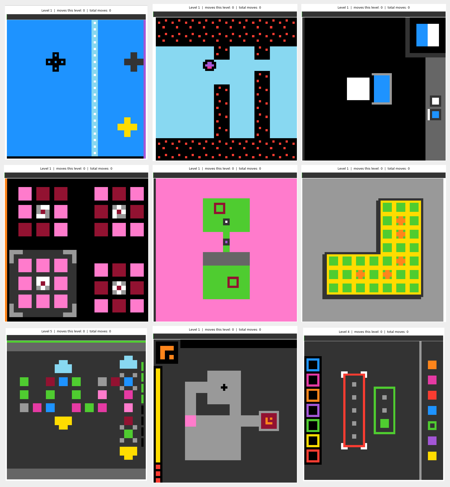
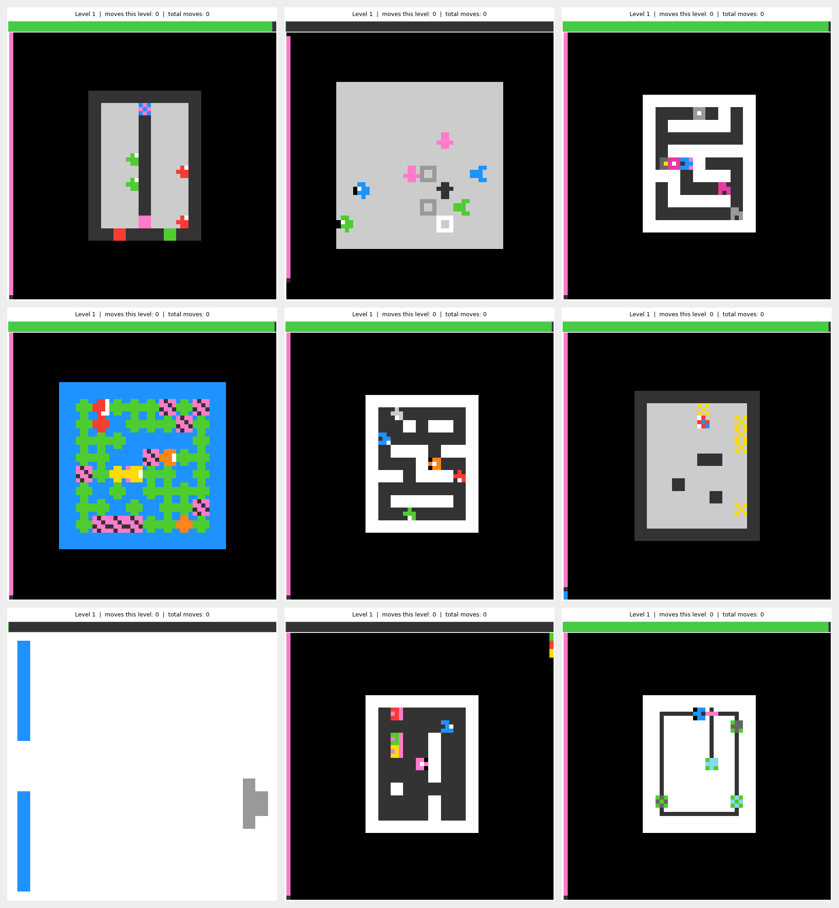
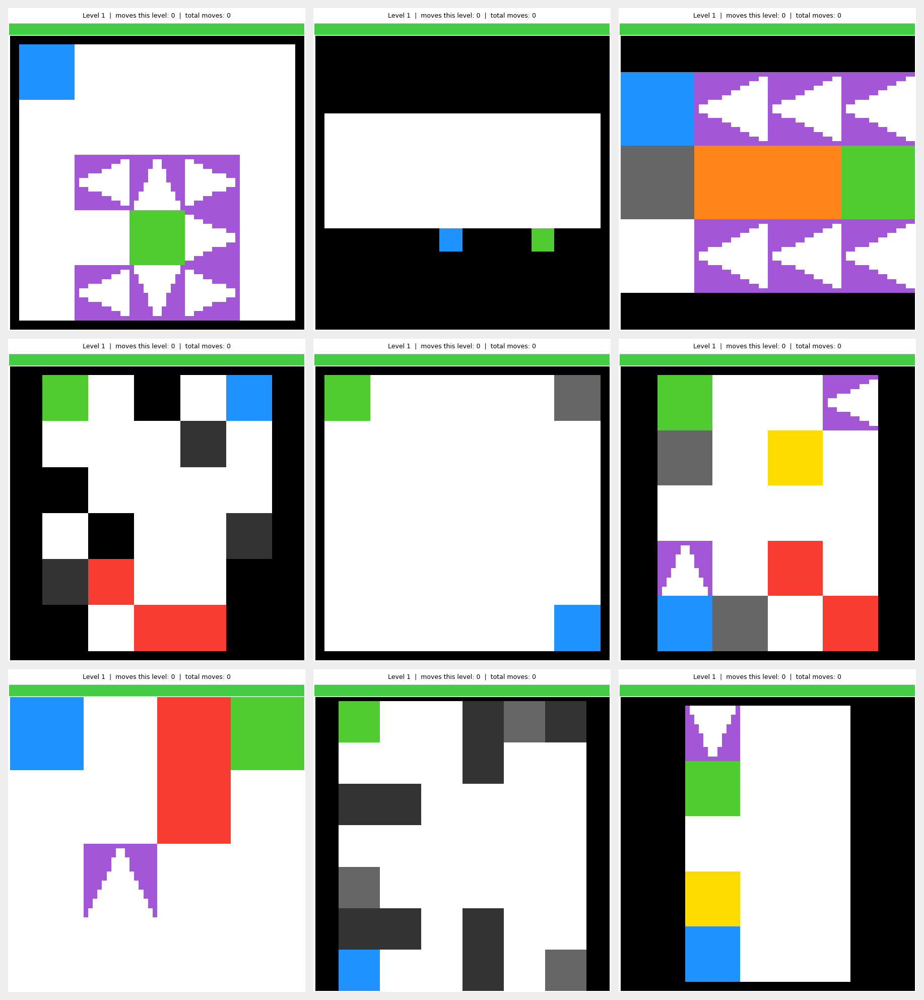
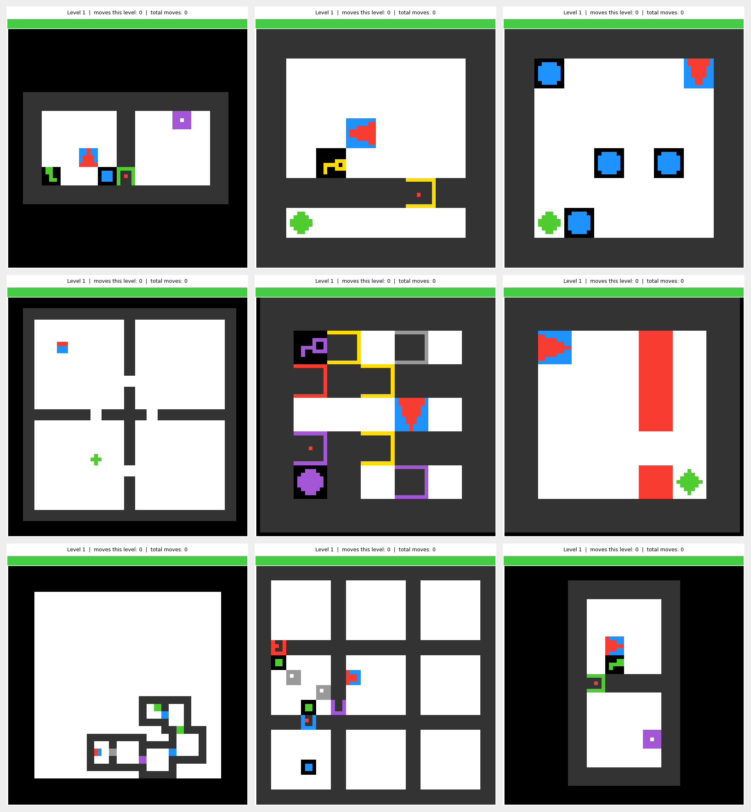
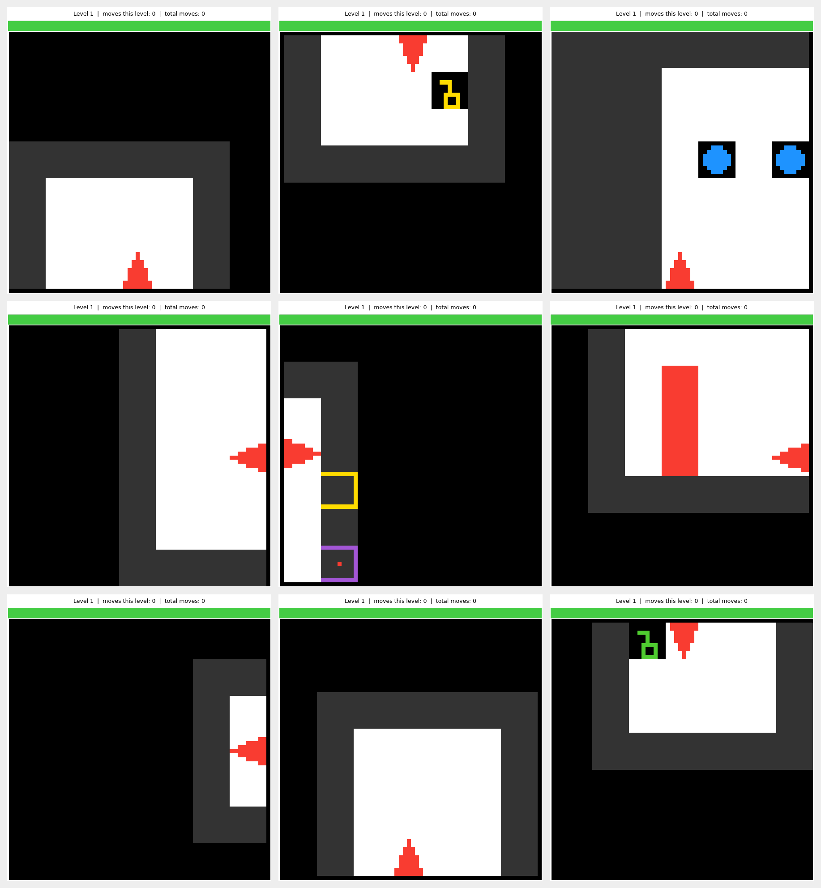
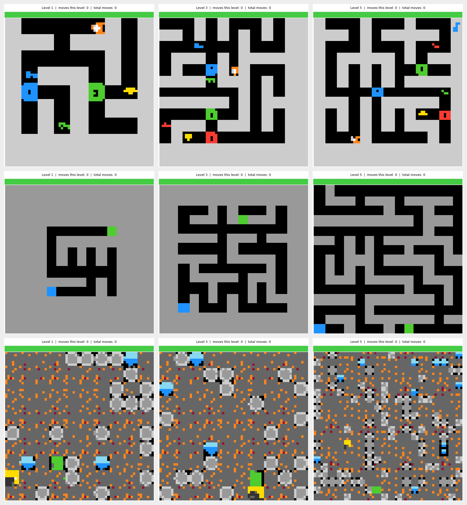
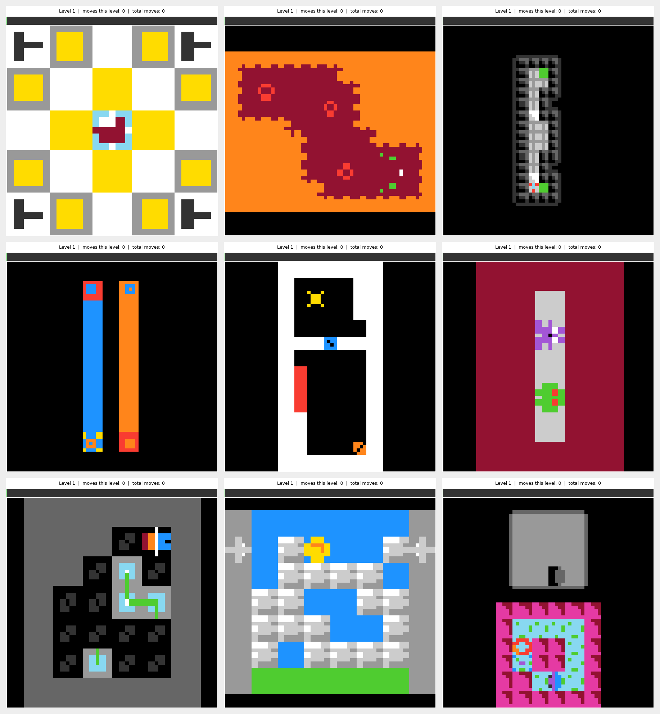

# ARC-AGI-3-style Games, Solvers and training data generators

## Introduction

This repository collects games from different sources into a common ARC-AGI-3-style framework for training data generation. It contains 429 distinct games, together with solvers and demonstration generators. Each game uses a subset of the ARC-AGI-3 action set and represents observations as a 64×64 matrix, allowing trajectories from different game collections to share a common format.

The collection combines ARC-AGI-3 games, Gym-Gridworlds, MiniGrid, Procgen, community-authored PuzzleScript games, and homemade games. Original game designs and environments are credited to their creators below.

Many of these games required adaptations to fit the ARC-AGI-3-style action set and observation format. I carried out this adaptation work to bring them into the common framework for training data generation. This repository also provides augmentation, solvers, and demonstration-generation tooling.

Additionally, most games have an element of randomization/data augmentation builtin. For example, if you run ar25 several times in a row using play.py, you will see different shapes and different starting positions. If desired, determinism can be preserved by specifying the seed number.

The examples below show nine games from each category, except Procgen, which shows three levels from each of its three supported games.

### ARC-native

Augmented/randomized versions of games from the [ARC Prize Foundation's ARC-AGI-3 benchmark](https://arcprize.org/arc-agi/3), including `ar25`, `ls20`, and `sb26`. These interactive reasoning tasks require an agent to discover game rules and goals through play. See the [official game collection](https://arcprize.org/tasks) and [technical report](https://arxiv.org/abs/2603.24621).



### Homemade

Custom games implemented for this collection, AI-generated from human-seeded ideas. These include navigation, sorting, and puzzle tasks, with some mechanics inspired by existing games. For example, `tw01`–`tw06` implement puzzle mechanics from [*The Witness* by Thekla](https://www.playstation.com/en-sa/games/the-witness/), and `mc:lamelightsout` is a mouse-controlled remake of Matthew VanDevander's [LameLightsOut](data/puzzlescript_games/LameLightsOut.txt).



### Gym-Gridworlds

[Gym-Gridworlds](https://github.com/sparisi/gym_gridworlds), by Simone Parisi, is a collection of Gymnasium environments for reinforcement-learning experiments. Tasks include navigation through walls, hazards, one-way passages, and other gridworld features. This repository renders them through its Gym-Gridworlds adapter. See the project's [software citation](https://github.com/sparisi/gym_gridworlds#citation) (Parisi, 2024).



### MiniGrid

[MiniGrid](https://github.com/Farama-Foundation/Minigrid), by Maxime Chevalier-Boisvert and collaborators and maintained by the Farama Foundation, provides configurable gridworld environments for reinforcement learning. Tasks include navigating rooms, collecting keys, opening doors, and avoiding obstacles. This category uses the full map as the observation. See the [documentation](https://minigrid.farama.org/) and the paper by Chevalier-Boisvert et al., [*Minigrid & Miniworld: Modular & Customizable Reinforcement Learning Environments for Goal-Oriented Tasks*](https://arxiv.org/abs/2306.13831) (NeurIPS, 2023).



### MiniGrid partial observations

The same [MiniGrid environments](https://minigrid.farama.org/) with observations restricted to the agent's local field of view, requiring decisions with incomplete information about the map. Both MiniGrid categories share the source and paper reference above.



### Procgen

[Procgen](https://github.com/openai/procgen), from OpenAI, is a benchmark of procedurally generated game environments designed to study reinforcement-learning generalization across levels. This repository supports `heist`, `maze`, and `miner`. See Karl Cobbe, Christopher Hesse, Jacob Hilton, and John Schulman, [*Leveraging Procedural Generation to Benchmark Reinforcement Learning*](https://arxiv.org/abs/1912.01588) (2019 preprint). The screenshots show levels 1, 3, and 5, with one game per row.



### PuzzleScript

[PuzzleScript](https://www.puzzlescript.net/) is an open-source language and browser-based engine for making tile-based puzzle games, created by [Stephen Lavelle (increpare)](https://www.increpare.com/2013/10/puzzlescript/). A game's text file defines its objects, sprites, rules, win conditions, and levels. The community has used it to create many block-pushing games and other grid-based puzzles; see the [language documentation](https://www.puzzlescript.net/Documentation/documentation.html).

This repository runs those game definitions through a Python adapter that implements a subset of PuzzleScript and renders observations in the common 64×64 format. Individual games are credited to their respective creators: examples include *A Knight's Tour* by Franklin P. Dyer, *Circuit Breaker* by Zithral, and *VRPS* by Jack Lance. The [game credits below](#puzzlescript-game-credits) link to the bundled definitions and their author metadata.



## Playing the games

To list the available games:

`python3 play.py`

To manually play a game: 

`python3 play.py (game name)`

example: `python3 play.py ps:vrps`

Actions:

- A, W, S, D for movement in most games
- Spacebar is ACTION 5
- r for reset
- u for undo

## Using the solvers to generate data

Each game has a solver associated with it, which can be used to generate training demonstrations for the purpose or Imitation learning, or bootstapping hybrid solutions ("Learning from demonstrations" + RL, for example).

`python3 master_data_generator.py --game_list list.csv --episodes 1000 --n_workers 6`

This generates 1000 training episodes per game in the game list.

## Format of the generated demonstration files

The `solvers/generate_*_training.py` scripts write one JSON file per successful
episode. By default, files are stored under
`data/training_multi_level/<game_id>/episode_00000_seed0.json`. The five-digit
number counts episodes written in that run; `seed0` identifies the game seed.
Failed attempts can leave gaps in the seed sequence. The seed is encoded in the
filename, not in the JSON object.

Each file contains a `game_id` and a list of independent level trajectories.
`game_id` is the generator's corpus identifier, for example `puzzlescript_wrap`
for the playable game `ps:wrap`. A level contains:

| Field | Meaning |
| --- | --- |
| `level_id` | The original zero-based level index. Some solvers emit only a supported, solvable subset, so indices need not be consecutive. |
| `observations` | An ordered list of frames, each a 64×64 matrix of integer palette indices, indexed as `[row][column]`. These are the rendered observations, including the game's visual augmentation. |
| `actions` | An ordered list of action records, including the initial RESET and any exploration or recovery steps. |

The following example illustrates the structure using **2×2 placeholder frames**
for readability; actual frames are always 64×64:

```json
{
  "game_id": "puzzlescript_wrap",
  "levels": [
    {
      "level_id": 0,
      "observations": [
        [[0, 0], [1, 0]],
        [[0, 0], [0, 1]]
      ],
      "actions": [
        {
          "type": "simple",
          "index": 0,
          "phase": "reset",
          "changed": false,
          "n_obs": 1,
          "optimal": null
        },
        {
          "type": "simple",
          "index": 4,
          "phase": "expert",
          "changed": true,
          "n_obs": 1,
          "optimal": [{"type": "simple", "index": 4}]
        }
      ]
    }
  ]
}
```

Action records describe both the action taken and, when available, the expert's
training target:

| Field | Meaning |
| --- | --- |
| `type` | `"simple"` for a discrete action, or `"mouse"` for a click. |
| `index` | The action ID: `0` is RESET, `1`–`5` are ACTION1–ACTION5, `6` is a click, and `7` is ACTION7 (typically undo). Available actions and their meaning depend on the game. |
| `data` | Present for mouse actions: `{"x": column, "y": row}` in the displayed 64×64 frame, with zero-based coordinates. |
| `phase` | `"reset"` for initialization/recovery, `"explore"` for exploratory play, `"burst"` for a perturbation burst, or `"expert"` for solver-guided play. |
| `changed` | Whether the settled observation differs from the preceding settled observation. The initial RESET uses `false`. This describes visible change, not necessarily a change in hidden game state. |
| `n_obs` | The number of consecutive frames produced by this action; usually `1`, but can be larger for animations. |
| `optimal` | A list of acceptable expert target actions at the state **before** the action, or `null` when unlabelled. Each entry contains `type`, `index`, and optional `data`. A solver may supply multiple equally good choices or a single selected action. |

Actions and click coordinates use the displayed screen's coordinate system,
including any rotation or reflection. The top-level `type`/`index`/`data` fields
record what was actually executed. During exploration or a burst, that action
can differ from `optimal`; do not treat every executed action as an expert
target. Use `phase` and the presence of `optimal` to select training examples.
Recovery RESETs may have a RESET target, while the initial RESET is unlabelled.

**Frame/action alignment:** `actions[0]` is the RESET that produces the initial
observation. When every `n_obs` is `1`, `actions[i]` for `i > 0` takes the game
from `observations[i-1]` to `observations[i]`. For animated actions, consume the
flat frame list using each action's frame count:

```python
offset = 0
previous = None
for action in level["actions"]:
    count = action.get("n_obs", 1)  # Older records may omit n_obs.
    frames = level["observations"][offset:offset + count]
    # `previous` is the pre-action observation (None for the initial RESET).
    # `frames` contains the resulting animation; frames[-1] is the settled frame.
    previous = frames[-1]
    offset += count
assert offset == len(level["observations"])
```

Thus `sum(action["n_obs"] for action in actions) == len(observations)`;
the number of actions need not equal the number of frames. Levels are separate
trajectories: do not create a transition between the end of one and the start
of the next. The format does not include per-step rewards, terminal flags, or
per-pixel labels; the generators save successful demonstrations.

These details describe the solvers' JSON output. The master launcher also
attempts conversion to `.ep.zst` files through `utils/convert_training_data.py`, deleting
the original JSON after successful verification by default. Use `--keep-json`
to retain the JSON alongside compressed output, or `--no-compress` to generate
JSON only. The conversion script must be present to use compression.

To compress existing JSON episodes without regenerating them, run
`python3 utils/convert_training_data.py --jobs 6` from the repository root.
This keeps the JSON originals; add `--delete` to remove them after verification.

## PuzzleScript game credits

The table credits the original creators of the 220 PuzzleScript games registered in `games/`, using the
`title` and `author` fields in their bundled source files. Each title links to
that file, which may also record a creator homepage or additional credits.
Some files contain my adaptations for this framework. “Not recorded in source” means the file
has no author field; it does not imply that the game has no creator.
The [source directory](data/puzzlescript_games/) also contains additional
PuzzleScript definitions beyond these registered games.

<details>
<summary>Show individual game credits</summary>

| Game / bundled source | Credited author(s) |
| --- | --- |
| [2020](data/puzzlescript_games/2020.txt) | bregehr |
| [2D Whale World](data/puzzlescript_games/whaleworld.txt) | increpare |
| [A Knight's Tour](data/puzzlescript_games/A_Knight%27s_Tour.txt) | Franklin P. Dyer |
| [Ad Infinitum v0.4.2 &#91;Implemented HighFloor, finished&#93;](data/puzzlescript_games/Ad_Infinitum_v0.4.2_%5BImplemented_HighFloor%2C_finished%5D.txt) | Tom Hermans @Auroriax |
| [Add Man 2: This Time It's Arithmetical](data/puzzlescript_games/Add_Man_2__This_Time_It%27s_Arithmetical.txt) | Adam Gashlin |
| [Aerobatics](data/puzzlescript_games/Aerobatics.txt) | Mark Richardson |
| [Alcazar](data/puzzlescript_games/Alcazar.txt) | TheIncredibleCompany |
| [Alley](data/puzzlescript_games/Alley.txt) | Connorses |
| [Amy](data/puzzlescript_games/Amy.txt) | Ben Erlebach |
| [Aperture Science Sokoban Testing Initiative](data/puzzlescript_games/Aperture_Science_Sokoban_Testing_Initiative.txt) | Ed Turner, with additional level design by Kalev Tait |
| [Atlas Shrank](data/puzzlescript_games/Atlas_Shrank.txt) | James Noeckel |
| [Autumn](data/puzzlescript_games/Autumn.txt) | Not recorded in source |
| [Back home](data/puzzlescript_games/Back_home.txt) | Le Slo |
| [Bad Example](data/puzzlescript_games/Bad_Example.txt) | Not recorded in source |
| [Baguettes](data/puzzlescript_games/Baguettes.txt) | bregehr |
| [Bal Ru's Curse cruelty-free demake](data/puzzlescript_games/Bal_Ru%27s_Curse_cruelty-free_demake.txt) | Creative Windows &#91;cloned by CHz&#93; |
| [Ball Bros](data/puzzlescript_games/Ball_Bros.txt) | Mark Richardson |
| [Beams and Flowers](data/puzzlescript_games/Beams_and_Flowers.txt) | BoredMatt |
| [Bichrome](data/puzzlescript_games/Bichrome.txt) | Nils Jung |
| [Black &amp; White](data/puzzlescript_games/Black_%26_White.txt) | Franklin P. Dyer |
| [Blind Maze a1](data/puzzlescript_games/Blind_Maze_a1.txt) | bregehr |
| [Block Faker](data/puzzlescript_games/blockfaker.txt) | Droqen |
| [Boolean Bloom 0.37](data/puzzlescript_games/Boolean_Bloom_0.37.txt) | vexorian |
| [Botsket Ball](data/puzzlescript_games/Botsket_Ball.txt) | Not recorded in source |
| [Boupha's Candle Quest](data/puzzlescript_games/Boupha%27s_Candle_Quest.txt) | hyperme |
| [Box Fill](data/puzzlescript_games/Box_Fill.txt) | Pichusuperlover |
| [Brain](data/puzzlescript_games/Brain.txt) | Isaac D |
| [Brendan loves mondays](data/puzzlescript_games/Brendan_loves_mondays.txt) | Benjy Bates |
| [Bridge](data/puzzlescript_games/Bridge.txt) | gamez7 |
| [Bridge-toggle Maze](data/puzzlescript_games/Bridge-toggle_Maze.txt) | Andrea Gilbert |
| [Broken Abacus](data/puzzlescript_games/Broken_Abacus.txt) | Le Slo |
| [Broken Maze](data/puzzlescript_games/Broken_Maze.txt) | David Ding |
| [Brotherhood](data/puzzlescript_games/Brotherhood.txt) | Son Nguyen |
| [Bubble Boy](data/puzzlescript_games/Bubble_Boy.txt) | Franklin P. Dyer |
| [Bubblegoban](data/puzzlescript_games/Bubblegoban.txt) | Franklin P. Dyer |
| [Cake Monsters](data/puzzlescript_games/cakemonsters.txt) | Matt Rix |
| [Cancel](data/puzzlescript_games/Cancel.txt) | Dean Huff |
| [Candy Bomb](data/puzzlescript_games/Candy_Bomb.txt) | Jonathan Brodsky |
| [Castle Elsewhere](data/puzzlescript_games/Castle_Elsewhere.txt) | Croubble |
| [Catrap](data/puzzlescript_games/Catrap.txt) | Gruntfuggly &#91;originally by Yutaka Isokawa&#93; |
| [Circuit Breaker](data/puzzlescript_games/Circuit_Breaker.txt) | Zithral |
| [Circulando](data/puzzlescript_games/Circulando.txt) | Marcos Donnantuoni |
| [Clean Up](data/puzzlescript_games/Clean_Up.txt) | Alex Yang |
| [Coin Dropper](data/puzzlescript_games/Coin_Dropper.txt) | Loneship Games |
| [Collect Gnocchi](data/puzzlescript_games/Collect_Gnocchi.txt) | Jonah Ostroff |
| [Color Combination](data/puzzlescript_games/Color_Combination.txt) | Pancake Robot |
| [Color Totems](data/puzzlescript_games/Color_Totems.txt) | Jeff Schubbe |
| [Count Mover](data/puzzlescript_games/Count_Mover.txt) | Jonah Ostroff |
| [Crate Rotate](data/puzzlescript_games/Crate_Rotate.txt) | Adam Gates |
| [CrateBlob](data/puzzlescript_games/CrateBlob.txt) | Zachary Abel |
| [Crocodiles Love Cookies](data/puzzlescript_games/Crocodiles_Love_Cookies.txt) | Ethan Clark |
| [Cyberpunk 2020](data/puzzlescript_games/Cyberpunk_2020.txt) | Lily, Gaelin, and Isabelle |
| [Dang I'm Huge](data/puzzlescript_games/Dang_I%27m_Huge.txt) | Guilherme Tows |
| [Dark Maze 3](data/puzzlescript_games/Dark_Maze_3.txt) | Adam Gates |
| [Darkness Sokoban](data/puzzlescript_games/Darkness_Sokoban.txt) | Stephen Lavelle |
| [Detroit: Become Immense](data/puzzlescript_games/Detroit__Become_Immense.txt) | Guilherme S. Tows |
| [Dharma Dojo demake](data/puzzlescript_games/Dharma_Dojo_demake.txt) | Metro &#91;cloned by CHz&#93; |
| [Directioban](data/puzzlescript_games/Directioban.txt) | Franklin P. Dyer |
| [Doktor Lezer](data/puzzlescript_games/Doktor_Lezer.txt) | Ax |
| [Don't Play On the Ice](data/puzzlescript_games/Don%27t_Play_On_the_Ice.txt) | Loneship Games |
| [Doors and Boxes](data/puzzlescript_games/Doors_and_Boxes.txt) | Marcos Donnantuoni |
| [Dotsnake](data/puzzlescript_games/Dotsnake.txt) | Franklin P. Dyer |
| [Dreaming of Strawberries](data/puzzlescript_games/Dreaming_of_Strawberries.txt) | Yifan Zheng &amp; Rachel Han |
| [Drop Kick](data/puzzlescript_games/Drop_Kick.txt) | Aaron Steed |
| [Drop Maze](data/puzzlescript_games/Drop_Maze.txt) | Guy Walker |
| [Electric Slide](data/puzzlescript_games/Electric_Slide.txt) | Tobin Mollett |
| [Elimination](data/puzzlescript_games/Elimination.txt) | Mrquaotta |
| [Enqueue](data/puzzlescript_games/Enqueue.txt) | Allen Webster |
| [EntrepotPhage Demake](data/puzzlescript_games/EntrepotPhage_Demake.txt) | Xavier Direz |
| [EpicJamGame](data/puzzlescript_games/EpicJamGame.txt) | Toombler |
| [Escape the Void Full](data/puzzlescript_games/Escape_the_Void_Full_.txt) | Croubble |
| [ESCAPE!](data/puzzlescript_games/ESCAPE%21.txt) | Adrian |
| [Escaping Limbo](data/puzzlescript_games/Escaping_Limbo.txt) | Doublepancake |
| [ESL Puzzle Game -- CHALLENGE MODE アダムのパズルゲーム](data/puzzlescript_games/ESL_Puzzle_Game_Challenge_Mode.txt) | A.R.Nakama |
| [Every Three Steps You Hit a Wall Out of Nowhere](data/puzzlescript_games/Every_Three_Steps_You_Hit_a_Wall_Out_of_Nowhere.txt) | Sky Chan |
| [Everything Antimatters](data/puzzlescript_games/Everything_Antimatters.txt) | Le Slo |
| [Explod](data/puzzlescript_games/Explod.txt) | CHz |
| [Filler](data/puzzlescript_games/Filler.txt) | HugoBDesigner |
| [Fireproof bomber](data/puzzlescript_games/Fireproof_bomber.txt) | MarcinK |
| [Five Pulloban Puzzles](data/puzzlescript_games/Five_Pulloban_Puzzles.txt) | Croubble |
| [Flood](data/puzzlescript_games/Flood.txt) | Franklin P. Dyer |
| [Flying Kick](data/puzzlescript_games/Flying_Kick.txt) | Aaron Steed |
| [Four-room tilt mazes](data/puzzlescript_games/Four-room_tilt_mazes.txt) | Andrea Gilbert |
| [Fractured Identity](data/puzzlescript_games/Fractured_Identity.txt) | Adam Conway |
| [FROWN INVERSION SQUAD](data/puzzlescript_games/FROWN_INVERSION_SQUAD.txt) | Jim Palmeri |
| [FULL CIRCLE](data/puzzlescript_games/FULL_CIRCLE.txt) | Julien Grimard |
| [Futuristic Block Pushing Game](data/puzzlescript_games/Futuristic_Block_Pushing_Game.txt) | Jazzy Williams |
| [GDD301 Game](data/puzzlescript_games/GDD301_Game.txt) | Mikey Bikey |
| [Glue Factory](data/puzzlescript_games/Glue_Factory.txt) | Cale Bradbury |
| [Gobble Rush!](data/puzzlescript_games/Gobble_Rush%21.txt) | Mark Richardson |
| [Goblin Hooblob](data/puzzlescript_games/Goblin_Hooblob.txt) | Evan Kuhn and Michael Franklin |
| [Hungry Kitty](data/puzzlescript_games/Hungry_Kitty.txt) | Adrian Arias |
| [I'm Sick Today](data/puzzlescript_games/I%27m_Sick_Today.txt) | Ben Porter |
| [IceCrates](data/puzzlescript_games/IceCrates.txt) | Tyler Glaiel |
| [IDOLS TO THE BURNT GOD](data/puzzlescript_games/IDOLS_TO_THE_BURNT_GOD.txt) | Edalcmagal |
| [Impasse](data/puzzlescript_games/Impasse.txt) | RatoLibre1 &#91;Wanderlands's Impasse demake&#93; |
| [IMS445 Puzzlescript Game "Buoy Deploy"](data/puzzlescript_games/IMS445_Puzzlescript_Game__Buoy_Deploy_.txt) | Breton Ballas |
| [Inchworm](data/puzzlescript_games/Inchworm.txt) | Tobin Mollett |
| [Kicking walls](data/puzzlescript_games/Kicking_walls.txt) | Jere Majava |
| [L.A.S.E.R.](data/puzzlescript_games/L.A.S.E.R.txt) | Franklin P. Dyer |
| [LameLightsOut](data/puzzlescript_games/LameLightsOut.txt) | Matthew VanDevander |
| [Leo](data/puzzlescript_games/Leo.txt) | Phillip Abram |
| [Lime Richard](data/puzzlescript_games/Lime_Richard.txt) | Franklin P. Dyer |
| [Little Girl, Big World](data/puzzlescript_games/Little_Girl%2C_Big_World.txt) | Franklin P. Dyer |
| [Love and Pieces](data/puzzlescript_games/lovendpieces.txt) | lexaloffle |
| [Mars Attacks](data/puzzlescript_games/Mars_Attacks.txt) | Not recorded in source |
| [Match 3 Block Push](data/puzzlescript_games/sokoban_match3.txt) | increpare |
| [Match Flow](data/puzzlescript_games/Match_Flow.txt) | edderiofer |
| [Mimic Translation](data/puzzlescript_games/Mimic_Translation.txt) | CNIAngel |
| [Miner To Miner Empire](data/puzzlescript_games/Miner_To_Miner_Empire.txt) | Savage |
| [Mini Nomerads](data/puzzlescript_games/Mini_Nomerads.txt) | Dan Williams |
| [Minimalist](data/puzzlescript_games/Minimalist.txt) | Marcos Perez |
| [Modality](data/puzzlescript_games/Modality.txt) | Sean Barrett |
| [neko puzzle](data/puzzlescript_games/nekopuzzle.txt) | lexaloffle |
| [One Way Street](data/puzzlescript_games/One_Way_Street.txt) | Franklin P. Dyer |
| [Opposition](data/puzzlescript_games/Opposition.txt) | Matthew VanDevander |
| [Ouroboros](data/puzzlescript_games/Ouroboros.txt) | Loneship Games |
| [Palette](data/puzzlescript_games/Palette.txt) | Versial |
| [Party Demon](data/puzzlescript_games/Party_Demon.txt) | Peter Smyth |
| [Pegs](data/puzzlescript_games/Pegs.txt) | Fred Coughlin / Rory O'Kane |
| [Piedra](data/puzzlescript_games/Piedra.txt) | Enzo |
| [Pitman MZ-700](data/puzzlescript_games/Pitman_MZ-700.txt) | BdR |
| [Polyomino Puzzles](data/puzzlescript_games/Polyomino_Puzzles.txt) | Zithral |
| [Puzzleboi](data/puzzlescript_games/Puzzleboi.txt) | Tristan Shawn Den Ouden |
| [PUZZLETALE](data/puzzlescript_games/PUZZLETALE.txt) | Connorses |
| [Rainbow Apples](data/puzzlescript_games/Rainbow_Apples.txt) | Alexander In Uganda |
| [RBG](data/puzzlescript_games/RBG.txt) | NiGHTcapD |
| [Rock, Paper, Scissors (v0.90 = v1.alpha)](data/puzzlescript_games/Rock%2C_Paper%2C_Scissors_%28v0.90_%3D_v1.alpha%29.txt) | chaotic_iak |
| [Roller Boi](data/puzzlescript_games/Roller_Boi.txt) | David Upshall and Itsjustkewa |
| [Rush Hour](data/puzzlescript_games/Rush_Hour.txt) | Hannes Petri |
| [Santa's Great Escape](data/puzzlescript_games/Santa%27s_Great_Escape.txt) | Bear &amp; Cow |
| [Savior](data/puzzlescript_games/Savior.txt) | Jack Lance |
| [Scale the Tower](data/puzzlescript_games/Scale_the_Tower.txt) | Not recorded in source |
| [Shared Bridges Game](data/puzzlescript_games/Shared_Bridges_Game.txt) | Puzzlescripters |
| [Sheep](data/puzzlescript_games/Sheep.txt) | Rabbit From Hell |
| [Silly Rabbit](data/puzzlescript_games/Silly_Rabbit.txt) | Jere Majava |
| [silver lungs](data/puzzlescript_games/silver_lungs.txt) | zuza |
| [Simple Block Pushing Game](data/puzzlescript_games/sokoban_sanity.txt) | David Skinner |
| [Slide Rule](data/puzzlescript_games/Slide_Rule.txt) | Jim Palmeri |
| [Slidings](data/puzzlescript_games/Slidings.txt) | Alain Brobecker |
| [Slidyyyyyyy](data/puzzlescript_games/Slidyyyyyyy.txt) | mokesmoe |
| [Slippy Penguin](data/puzzlescript_games/Slippy_Penguin.txt) | Ryan Woods |
| [Smother](data/puzzlescript_games/Smother.txt) | Team Borse |
| [Snake Crate](data/puzzlescript_games/Snake_Crate.txt) | Joshua Rigsby |
| [Snakeoban](data/puzzlescript_games/Snakeoban.txt) | Jack Lance |
| [Snek](data/puzzlescript_games/Snek.txt) | Aaron Steed |
| [Sokobaiogenesis](data/puzzlescript_games/Sokobaiogenesis.txt) | Bagenzo |
| [Sokoban Dungeon](data/puzzlescript_games/Sokoban_Dungeon.txt) | Joseph King |
| [Sokoban Flipped](data/puzzlescript_games/Sokoban_Flipped.txt) | Franklin P. Dyer |
| [Sokolor EX](data/puzzlescript_games/Sokolor_EX.txt) | ncrecc |
| [Sokoslam](data/puzzlescript_games/Sokoslam.txt) | Aaron Steed |
| [Sokubunny and the colored Boxes](data/puzzlescript_games/Sokubunny_and_the_colored_Boxes.txt) | Lucas Boedeker |
| [Soliquid](data/puzzlescript_games/Soliquid.txt) | Anton Klinger |
| [Something](data/puzzlescript_games/Something.txt) | arrogant.gamer |
| [Sorx-Aubi](data/puzzlescript_games/Sorx-Aubi.txt) | Ali Nikkhah |
| [Space Expedition](data/puzzlescript_games/Space_Expedition.txt) | RILEY VAN ETTEN AND ORRY PAYNTER |
| [Spacekoban](data/puzzlescript_games/Spacekoban.txt) | Connorses &#91;Loneship Games&#93; |
| [Spider's Hollow](data/puzzlescript_games/Spider%27s_Hollow.txt) | John Thyer |
| [Sponge Game](data/puzzlescript_games/Sponge_Game.txt) | Merge |
| [Spring](data/puzzlescript_games/Spring.txt) | Not recorded in source |
| [Stained Glass](data/puzzlescript_games/Stained_Glass.txt) | @krabby.pabby |
| [Stand](data/puzzlescript_games/Stand.txt) | Connorses |
| [Stand aside, everyone! I take large steps!](data/puzzlescript_games/Stand_aside%2C_everyone%21_I_take_large_steps%21.txt) | ncrecc |
| [Stand II](data/puzzlescript_games/Stand_II.txt) | Connorses &#91;Loneship Games&#93; |
| [Stand III](data/puzzlescript_games/Stand_III.txt) | Connorses &#91;Loneship Games&#93; |
| [Stand Off](data/puzzlescript_games/Stand_Off.txt) | Mark Richardson |
| [Sticky Candy Puzzle Saga](data/puzzlescript_games/stick_candy_puzzle_saga.txt) | Alan Hazelden |
| [Sticky Cubes](data/puzzlescript_games/Sticky_Cubes.txt) | PuzzleScriptGamer |
| [Stickyban](data/puzzlescript_games/Stickyban.txt) | Connorses / Loneship Games |
| [Straighten Up](data/puzzlescript_games/Straighten_Up.txt) | Ricky |
| [Strange Warehouse](data/puzzlescript_games/Strange_Warehouse.txt) | Justas Dabrila |
| [STRATA-GEMS](data/puzzlescript_games/STRATA-GEMS.txt) | Silvano Sorrentino |
| [Swap Sokoban](data/puzzlescript_games/Swap_Sokoban.txt) | Franklin P. Dyer |
| [Swap the block!](data/puzzlescript_games/_Swap_the_block%21.txt) | Amber |
| [Sweet Hints](data/puzzlescript_games/Sweet_Hints.txt) | Marcos Donnantuoni |
| [Switcheroo](data/puzzlescript_games/Switcheroo.txt) | CNIAngel |
| [Tele](data/puzzlescript_games/Tele.txt) | Pichusuperlover |
| [The Blob](data/puzzlescript_games/The_Blob.txt) | Guillem G T |
| [The Dungeon of Squeamish Chickens](data/puzzlescript_games/The_Dungeon_of_Squeamish_Chickens.txt) | Ampersand_S |
| [The Nuevo Asylum](data/puzzlescript_games/The_Nuevo_Asylum.txt) | Kyle Davis, Zack Lewis, Zack Long |
| [The Observable Universe](data/puzzlescript_games/The_Observable_Universe.txt) | Paul Jeffrey |
| [The Saga of the Candy Scroll](data/puzzlescript_games/the_saga_of_the_candy_scroll.txt) | Jim Palmeri |
| [The Trouble with Toasters](data/puzzlescript_games/The_Trouble_with_Toasters.txt) | Edward Brown |
| [The Workshop](data/puzzlescript_games/The_Workshop.txt) | bregehr |
| [The World Beneath the Surface](data/puzzlescript_games/The_World_Beneath_the_Surface.txt) | CrocaDino |
| [There is no-one here to help you](data/puzzlescript_games/There_is_no-one_here_to_help_you.txt) | LJRadio |
| [This Adventure World](data/puzzlescript_games/This_Adventure_World.txt) | Orange_Nitro |
| [Tile Tiler](data/puzzlescript_games/Tile_Tiler.txt) | Sky Chan |
| [Time-reversed Microban](data/puzzlescript_games/Time-reversed_Microban.txt) | Toph Wells with apologies to David Skinner |
| [Time-Reversed Minicosmos](data/puzzlescript_games/Time-Reversed_Minicosmos.txt) | Toph Wells with apologies to Aymeric du Peloux |
| [Together Alone](data/puzzlescript_games/Together_Alone.txt) | Qwok Games |
| [Tornado Tamer](data/puzzlescript_games/Tornado_Tamer.txt) | Mark Foster |
| [Touchdown Heroes (Prototype)](data/puzzlescript_games/Touchdown_Heroes_%28Prototype%29.txt) | Matt Ventre |
| [Tour de Four](data/puzzlescript_games/_Tour_de_Four.txt) | Chris Pickel |
| [Towers of Hanoi](data/puzzlescript_games/Towers_of_Hanoi.txt) | Daniel Sherlock |
| [Towers of Saigon](data/puzzlescript_games/Towers_of_Saigon.txt) | Theta Games |
| [Tractor Beam Sokoban9](data/puzzlescript_games/Tractor_Beam_Sokoban9.txt) | Franklin P. Dyer |
| [Train](data/puzzlescript_games/Train.txt) | Not recorded in source |
| [Travelling salesman](data/puzzlescript_games/Travelling_salesman.txt) | Rabbit from Hell |
| [Tricky Tower](data/puzzlescript_games/Tricky_Tower.txt) | Zithral |
| [Tumblin'](data/puzzlescript_games/Tumblin%27.txt) | Westward |
| [TwinPush](data/puzzlescript_games/TwinPush.txt) | Alex &amp; Michael |
| [Two level puzzle](data/puzzlescript_games/Two_level_puzzle.txt) | Weeble |
| [Two-faced](data/puzzlescript_games/Two-faced.txt) | Le Slo |
| [Undertale X/O Puzzle](data/puzzlescript_games/Undertale_X_O_Puzzle.txt) | Toby Fox, transcribed by PKRB |
| [Upstairs Downstairs](data/puzzlescript_games/Upstairs_Downstairs.txt) | Jacsn |
| [Variations](data/puzzlescript_games/Variations.txt) | arrogant.gamer |
| [Veggie Jam](data/puzzlescript_games/Veggie_Jam.txt) | Big Tiger |
| [Velocity Castle](data/puzzlescript_games/Velocity_Castle.txt) | Tobin Mollett |
| [VEXT EDIT](data/puzzlescript_games/VEXT_EDIT.txt) | JACK |
| [VRPS](data/puzzlescript_games/VRPS.txt) | Jack Lance |
| [Weird Bug](data/puzzlescript_games/Weird_Bug.txt) | Jonah Ostroff (Hey you should add yourself as a co-author once you've fixed everything.) |
| [Weird Dave](data/puzzlescript_games/Weird_Dave.txt) | HugoBDesigner |
| [where did all this ice come from?](data/puzzlescript_games/where_did_all_this_ice_come_from_.txt) | thefifthmatt |
| [Winter](data/puzzlescript_games/Winter.txt) | Not recorded in source |
| [Wizard School!](data/puzzlescript_games/Wizard_School%21.txt) | Luke Davies |
| [Wrap](data/puzzlescript_games/Wrap.txt) | Joseph Mansfield |
| [Wriggler demake](data/puzzlescript_games/Wriggler_demake.txt) | @_ardeej |
| [Zombie Invasion](data/puzzlescript_games/Zombie_Invasion.txt) | Owen |
| [Zombie Rescue](data/puzzlescript_games/Zombie_Rescue.txt) | Matt Slaybaugh |

</details>
